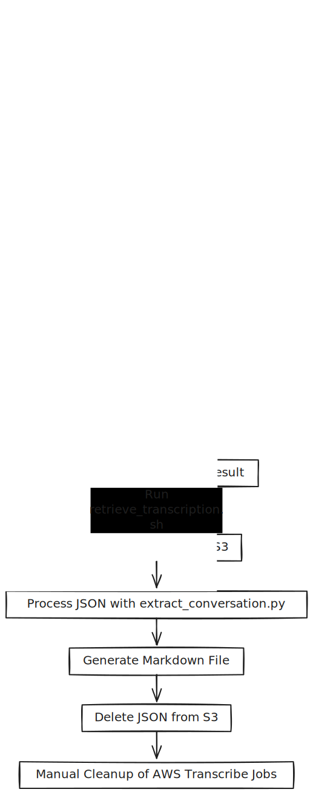

# AWS Transcribe Audio to Markdown

This project provides a set of scripts to transcribe audio files using AWS Transcribe and extract the conversation into a Markdown file. It includes shell scripts for managing transcription jobs and a Python script for processing the transcription output.

## Workflow





## Prerequisites

- **AWS CLI**: Ensure you have the AWS CLI installed and configured with your credentials.
- **Python**: Ensure you have Python installed on your system.
- **Virtual Environment**: Use a virtual environment to manage dependencies.
- **AWS Account**: You need an AWS account with permissions to use AWS Transcribe and S3.

## Setup

1. **Configure AWS CLI**: Run `aws configure` to set up your AWS credentials and default region.

2. **Create and Activate Virtual Environment**:
   ```bash
   python -m venv venv
   source venv/bin/activate  # On Windows use `venv\Scripts\activate`
   ```

3. **Install Required Packages**:
   ```bash
   pip install -r requirements.txt
   ```

4. **Edit `.env` File**: Copy `.env` to `.env` file with your specific AWS profile, transcription job name, output bucket name, and language code, example:
   ```plaintext
   AWS_PROFILE=MY_AWS_SSO_PROFILE
   TRANSCRIPTION_JOB_NAME=transcription-job
   OUTPUT_BUCKET=transcribe-output-bucket
   LANGUAGE_CODE=en-US
   ```

## Usage

### Step 1: Start Transcription Job

Run the `start_transcription.sh` script to start a transcription job for your audio file. Provide the path to the audio file and the S3 bucket name as arguments.

```bash
./start_transcription.sh path/to/audio.wav input-s3-bucket-name
```

### Step 2: Check Transcription Job Status

Run the `check_status.sh` script to check the status of your transcription job.

```bash
./check_status.sh
```

### Step 3: Retrieve and Process Transcription Result

Once the transcription job is completed, run the `retrieve_transcription.sh` script to download the transcription result, process it, and clean up the S3 bucket.

```bash
./retrieve_transcription.sh
```

## Output

The conversation will be saved in a file named `podcast_conversation.md`, formatted in Markdown for easy reading. The JSON file will be deleted from the S3 bucket after processing.

## Notes

- **S3 Bucket Policies**: Ensure your S3 bucket policies allow access to AWS Transcribe.
- **AWS CLI Profile**: The scripts use the AWS CLI profile specified in the `.env` file. Make sure this profile is correctly configured.
- **Manual Cleanup**: Remember to manually delete completed transcription jobs from AWS Transcribe to avoid unnecessary charges and clutter. You can do this using the AWS Management Console or the AWS CLI:
  ```bash
  aws transcribe delete-transcription-job --transcription-job-name your-job-name --profile your-profile
  ```
- **Virtual Environment**: The virtual environment (`venv`) is excluded from version control via `.gitignore`.

## License

This project is licensed under the Apache 2.0 License. See the [LICENSE](LICENSE) file for details.